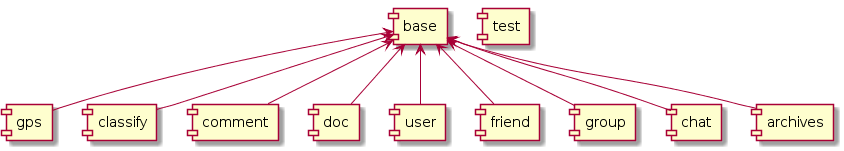

Ranch旨在构建一系列基于[Tephra](https://github.com/heisedebaise/tephra)的微服务模块，各模块间相对独立，通过[Carousel](https://github.com/heisedebaise/carousel)服务中间件进行交互。

Ranch将实现并开源一系列通用的业务模块，并建议各项目在此基础上开发业务模块。并且Ranch基于[Apache](LICENSE)开源协议，因此各项目可直接使用并且不需要开源项目相关的模块，也不需要为此支付任何成本。

Ranch将尽可能提取通用的业务模块，并且使应用场景尽可能简单、通用。Ranch将一如既往地追求单元测试覆盖率100%，需求、设计、编码，均力争精良。

基于Tephra对Carousel的优化，使得当多个Ranch组件部署在同一个Web容器时，组件间的交互将直接使用本地提供的服务，而不再去请求Carousel注册的服务，以减少网络请求，提升处理能力。同时允许对特定数据请求进行缓存，以加快处理效率。

Ranch目前包含以下模块：
- [base](ranch-base/) —— 基础支持。
- [gps](ranch-gps/) —— GPS操作。
- [classify](ranch-classify/) —— 分类 & 数据字典，支持多级。
- [classify-helper](ranch-classify-helper/) —— 分类 & 数据字典支持。
- [comment](ranch-comment/) —— 评论。
- [doc](ranch-doc/) —— 文档。
- [user](ranch-user/) —— 用户 & 认证。
- [user-helper](ranch-user-helper/) —— 用户支持。
- [friend](ranch-friend/) —— 好友。
- [group](ranch-group/) —— 群组。
- [message](ranch-message/) —— 消息 & 即时通讯。
- [snapshot](ranch-snapshot/) —— 快照。
- [last](ranch-last/) —— 最近日志。
- [last-helper](ranch-last-helper/) —— 最近日志支持。
- [address](ranch-last-helper/) —— 地址。
- [archives](ranch-archives/) —— 档案。
- [test](ranch-test/) —— 单元测试支持。

# 微服务 & SOA & 组件化设计

组件化设计是指将一个完整的系统化整为零，拆分成多个可独立、或耦合较低的组件集。其优势是使各组件足够简单，以达到普通的开发人员也能胜任复杂系统开发的目的，进而使各组件可以不断优化以适应更广泛的场景。

当组件无法完全满足某一特定场景时，又可以根据现有的组件进行分支开发，以快速生产出稳定的、能满足需求的组件。

组件化是现代制造业的重要设计思想，即其正确性已被验证。不管是制造一辆汽车，还是一个收音机，都是由多个组件拼装而成。每个组件单元都相对独立，又相互依存，并且组件可以不断被优化以获得更佳性能及适应更多的场景。

SOA是组件化设计的一个重要实践，提倡面向服务，是一种粗粒度、松耦合的服务架构。

微服务是SOA更细小颗粒度、更轻量级的实践，提倡通过HTTP(S)+RESTful提供服务，以提升跨平台性、降低开发成本、减少运行开销。
