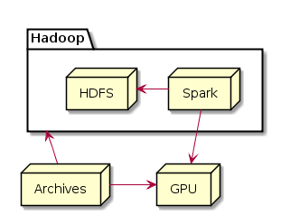
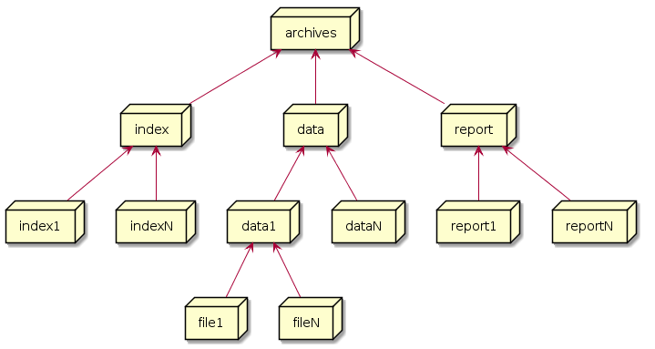

# 档案

档案模块旨在构建一个面向大量用户档案数据的管理服务，实现对档案数据的存储与检索。档案模块将致力于解决以下几个问题：

- 大量档案数据的加密存储
- 大量档案数据的快速检索

## 大量数据

档案数据用于记录个体的数据，每一个个体拥有一份独立的数据。档案数据通常具有以下明显的特征：

- 数据保存后，很少修改；
- 会不断增加新的数据到个体档案中；
- 档案数据包含文本、图片、音频、视频等；
- 档案数据不会被删除；
- 个体数量庞大，并且会不断增加；
- 档案数据属个体隐私数据；
- 需要对单个个体数据进行检索；
- 对特定条件的数据集进行检索或统计计算。

## 存储 & 加密

由于档案数据是不可结构化的，或者只有部分是可结构化的，因此非结构化数据格式会更适合档案数据的存储。而档案数据的多样性（文本、图片、音频、视频等）决定了使用文件存储档案数据会更合适。

每个个体都会拥有一个全局唯一的身份ID，并且此身份ID几乎不会发生变化，因此档案数据的存储以此身份ID作为档案ID。

档案数据属个体隐私，因此存储时需进行加密。并且档案数据量庞大，应尽可能使用高效的加解密算法，或者借助GPU进行加解密，以获得较高的处理能力。

## 快速检索 & 统计

对于单个档案数据的检索，可以通过身份ID快速获取到档案数据。

对于特定条件的检索，由于档案数据极少发生变更，因此可以在保存数据时对相应的检索条件建立、更新索引，使得在检索数据时可以直接获取到检索档案的身份ID集，从而可以快速返回检索结果。

统计分析是对档案数据价值的深入挖掘，是大数据的价值体现，因此统计分析应采用高效的分布式架构，以更快地获取到计算结果。

## 技术架构

- 使用HDFS文件系统存储档案数据，可以应对档案数据的快速增长；
- 对检索条件进行哈希计算，并归并档案身份ID，可以获得快速的检索响应；
- 使用Spark对数据进行分析，可以获得更快速的统计处理能力；
- 使用GPU进行哈希、加解密计算，可以获得高效的处理能力。

### 数据存储结构

- index为检索索引；
- data为档案数据，data[1-N]为身份ID；
- report为统计分析结果；
- file为加密后的档案数据。
